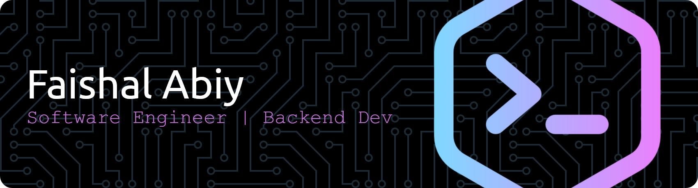

## WELCOME ABROAD! 🚀

im Abiy, and i am openly working on any project and ideas anyone approach me. Currently working as IT Staff at [PT.Rekaindo Global Jasa (INKA Group)](ptrekaindo.co.id). a Railway Specialist Company 

any business about some projects or anything about work? you can always reach on my work [email](faishalabiy@ptrekaindo.co.id) 
**📫 faishalabiy@ptrekaindo.co.id**

##### So far, i worked on many projects with

## ---------------------------------------------------------

##### Here is my Track Record 💾

## ---------------------------------------------------------

##### Lets Connect! 🔗🤙

